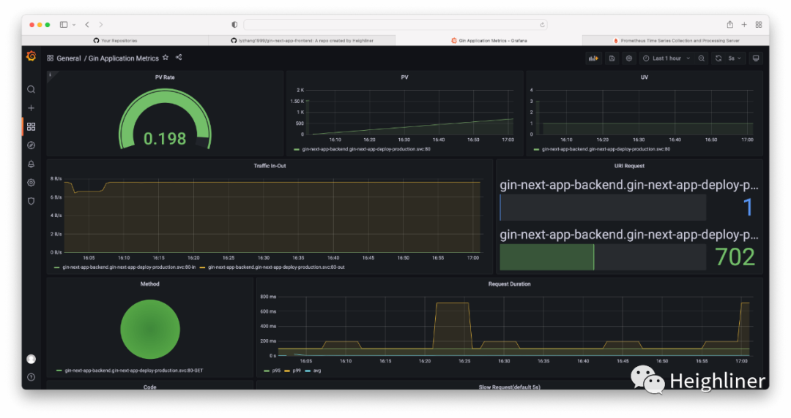
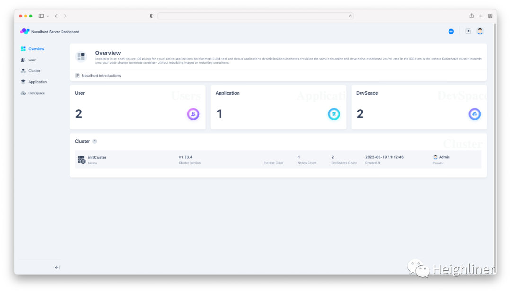

## The Cloud Trends

Today the cloud brings us to a new era:
With an increasing number of cloud infrastructure services, a dedicated team of developers can ship a compelling product in almost any industry within weeks.
The cloud has become the infrastructure for the society like water and electricity.
We have witnessed the growth and potential of the cloud industry when COVID hit the global economy.

Along with it comes the fast-growing cloud native community.
Cloud native technologies are changing the way developers use cloud services via open source standards.
In this way, developers can build their apps across clouds without being locked into specific vendors.
Since its inception, CNCF (Cloud Native Computing Foundation) has incubated hundreds of projects including Kubernetes.
It is still evolving fast and providing developers with more projects and standard interfaces to use the cloud.
By now, being cloud native not only means adopting Kubernetes, but also building the best practices for the entire software development lifecycle.
Here we are listing some of the latest cloud native trends:

- **DevSecOps**:
    Securing your cloud infrastructure will continue to be the primary focus of IT management and software engineering teams.
    As the software supply chain and privacy policies matures, security and conformance requirements will need to be validated in every step of software delivery and maintenance.
- **Cloud IDE**:
    Developers are often trapped by not enough hardware resources of their laptops, inconsistency between development and production environments, and complexity of microservice dependencies.
    Nonetheless, projects like [Nocalhost](https://nocalhost.dev) are trying to make it easier for developers to put their development environments on the cloud. It is closer to their production environments. It is also easier to setup since all they need is an IDE in local, and achieves convenient collaborative development.
- **Observability**:
    It is becoming more and more standardized to collect logs and metrics as the adoption of [OpenTelemetry](https://opentelemetry.io) increases.
    This has improved the development of digital transparency of cloud apps.
    Meanwhile, new trending [continuous profiling](https://www.parca.dev) projects are helping improve problem debugging and performance analysis.
    It has made them to a new level that you can see what just happened.
    Moreover, the rise of [ePBF adoption in observability](https://pixielabs.ai) will make it possible to observe with no instrumentation, which frees
    developers and improve their efficiency.
- **GitOps**:
    As the topics of cloud native gets more and more popular, CI/CD has become the primary focus among all discussions.
    GitOps, as a new pattern to do continuous delivery for cloud native community, is trying to write down to the Git repository all the infrastructure dependencies in a declarative format.
    In doing so, developers will get better version control and access management for their application infrastructure.
    Recently, the founders of ArgoCD project has created a startup ([akuity.io](https://akuity.io)) for commercializing ArgoCD.
    This reflects the growing demand for such GitOps project and endorsement from capital markets.

## Are Developers Satisfied?

Even though having so many choices from the cloud native community, developers still have complex feelings:

- On the one hand, they are happy and want to use all these projects as soon as possible.
  In this way they can build best practices in their applications based on open standards, and have a future-proof application architecture.
- On the other hand, they are scared and overwhelmed by the complexities of these projects.
  It is very complicated and difficult to setup these open source projects from end to end.
  Moreover, the iteration speed of these projects is very high. Developers don't have enough time and energe to keep up with.

## Heighliner Born For Developers

Developers' time is precious.
If they can't focus themselves fully on developing applications per se while wasting too much time to get these infrastructure tools to work, it will eventually create huge cost to developers and enterprises.

Today we are trying to solve this problem by providing a solution called **Heighliner**.
It is a modern developer tool that deliver your application **stack as code**.
You can codify low level details into human-readable configuration files that you can version, reuse, and share.
We try to tell developers via Heighliner that "Your cloud native stack can be managed just like your application code. You deserve a better user experience."
We say that because Heighliner is:

- **Developer-centric**:
    Heighliner tries to define the entire application stack from a developer-centric perspective.
    This includes code repositories, app frameworks, CI/CD pipelines, Helm Charts, monitoring dashboards, alerting rules, Cloud IDE configurations, and so on.
- **Supporting Languages and frameworks**:
    We provide official stacks for popular languages and frameworks. Users can choose one of these stacks to spin up cloud native development environments in one click.
    Currently the languages and frameworks we supports include Go, Spring, Next.js, Vue.js, Remix, etc.
- **Customizable**:
    Users can customize every single step of any stack.
    We are glad that Docker creator Solomon has created [Dagger](https://dagger.io/).
    We have used Dagger to significantly simplify our user experience to develop Heighliner stacks.
    We support using Dagger to customize any stack.
    Besides Dagger libraries, we provide an additional set of libraries targeted for cloud native technolgoies.

With all these benefits of Heighliner, developers can continuously take advantage of the evolution of cloud native technologies.
The latest technology updates will be consumed in a way that developers are familiar with -- using code.
In this way it helps developers continuously evolve the entire application architecture.

## Getting Hands-on

In the following we will demonstrate how to spin up an entire cloud native development environment within 2 minutes.

**Step 1**: Install Heighliner tool

```shell
$ curl -L https://dl.h8r.io/hln/install.sh | sh
```

**Step 2**: Prepare a Kubernetes cluster

```shell
$ kubectl version
Client Version: version.Info{Major:"1", Minor:"24", GitVersion:"v1.24.0", GitCommit:"4ce5a8954017644c5420bae81d72b09b735c21f0", GitTreeState:"clean", BuildDate:"2022-05-03T13:46:05Z", GoVersion:"go1.18.1", Compiler:"gc", Platform:"darwin/arm64"}
Kustomize Version: v4.5.4
Server Version: version.Info{Major:"1", Minor:"23", GitVersion:"v1.23.5", GitCommit:"c285e781331a3785a7f436042c65c5641ce8a9e9", GitTreeState:"clean", BuildDate:"2022-03-24T22:10:16Z", GoVersion:"go1.17.8", Compiler:"gc", Platform:"linux/arm64"}
```

**Step 3**: Create your app development environment in one command

```shell
$ hln up hello-world -s sample -i
```


Eventually Heighliner will build and deploy your application:


Heighliner will create automatically for you the Github repositories, Helm Chart, CI/CD pipelines, DNS domain routing, ArgoCD apps, Grafana dashboards, Nocalhost DevSpace, etc.





## Embrace Community

By now, Heighliner has provided many out-of-box features that you can play with. You can learn more at [heighliner.dev](https://heighliner.dev).

In the mean time, we believe in the long term value that open source community will bring us.
ALl projects of Heighliner including official stacks are Apache-licensed.
We are also contributing to open source projects such as Dagger, Nocalhost.
Our goal is to build an open community that benefits every developer in the future.

Heighliner is still in the early stages of development. To grow and prosper it needs badly one important factor -- you as a developer.
We welcome you to join us and contribute to the development of Heighliner.

If you are interested in Heighliner, Dagger, Nocalhost, or any other cloud native projects, you can join our [Discord channel](https://discord.gg/WphTbdVHFA) or other [community channels](https://heighliner.dev/contact-us).
